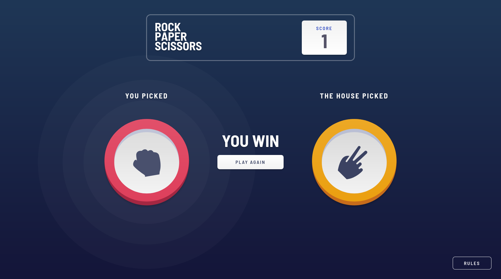

# Frontend Mentor - Rock, Paper, Scissors solution

This is a solution to the [Rock, Paper, Scissors challenge on Frontend Mentor](https://www.frontendmentor.io/challenges/rock-paper-scissors-game-pTgwgvgH). Frontend Mentor challenges help you improve your coding skills by building realistic projects.

## Table of contents

- [Overview](#overview)
  - [The challenge](#the-challenge)
  - [Screenshot](#screenshot)
  - [Links](#links)
- [My process](#my-process)
  - [Built with](#built-with)
- [Author](#author)

## Overview

### The challenge

Users should be able to:

- View the optimal layout for the game depending on their device's screen size
- Play Rock, Paper, Scissors against the computer
- Maintain the state of the score after refreshing the browser _(optional)_
- **Bonus**: Play Rock, Paper, Scissors, Lizard, Spock against the computer _(optional)_

### Screenshot

  
Desktop

### Links

- Solution URL: [Frontend Mentor Solution](https://www.frontendmentor.io/solutions/rock-paper-scissors-game-using-scss-modules-react-redux-toolkit-Bk5hEOVmc)
- Live Site URL: [Github Pages](https://rmzvr.github.io/rock-paper-scissors-game/)

## My process

### Built with

- Semantic HTML5 markup
- (S)CSS Modules
- [React](https://reactjs.org/) - JS library
- React Hooks
- Redux Toolkit

## Author

- [Github](https://github.com/rmzvr)
- [Website](https://rmzvr.dev)
- [LinkedIn](https://www.linkedin.com/in/rmzvr)
- [Codewars](https://www.codewars.com/users/rmzvr)
- [Frontend Mentor](https://www.frontendmentor.io/profile/rmzvr)
